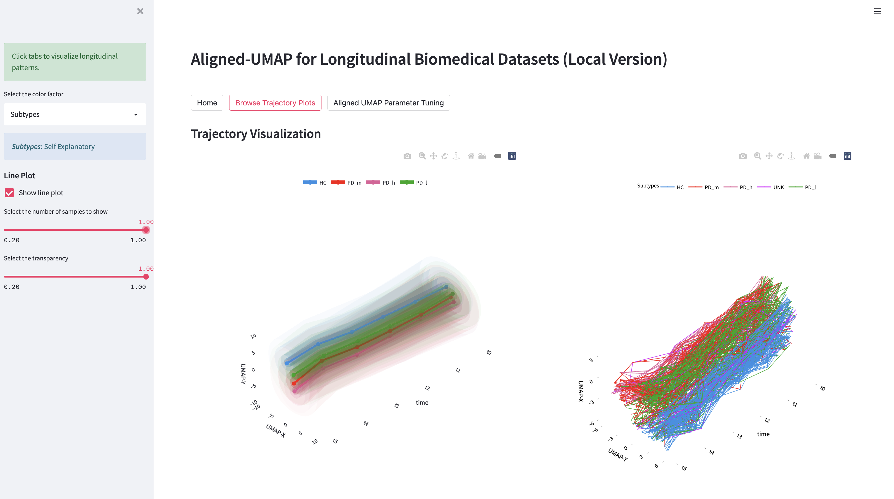

# AlignedUMAP-BiomedicalData
## Information

This is a repository for the analysis presented in paper **Aligned-UMAP for longitudinal datasets analysis in biomedical research** [[link to preprint](https://www.biorxiv.org/content/10.1101/2022.12.12.518225v1)]. 
It also contains the code for [streamlit dashboard](https://alignedumap-biomedicaldata.streamlit.app) developed for better visualization of longitudinal trajectories.

### Key Points
- Used python implementation of [Aligned-UMAP](https://umap-learn.readthedocs.io/en/latest/aligned_umap_basic_usage.html) from [umap-learn](https://umap-learn.readthedocs.io/en/latest/) package
- Explored the utility of Aligned-UMAP in multiple longitudinal biomedical datasets 
- Offer insights on optimal uses for the technique such as effect of hyperparameters
- An interactive 3D visualization of trajectory plots via streamlit dashboard to discover hidden patterns

## Installation
- Install [Anaconda Distribution](https://www.anaconda.com/products/distribution#download)
- Create a virtual environment to set up python interpreter

To create and activate a virtual environment:
```
conda create -n AlignedUMAP python=3.8
conda install -n AlignedUMAP -c conda-forge tslearn omegaconf umap-learn # for AlignedUMAP execution
conda install -n AlignedUMAP -c congda-forge wand python-kaleido  # for visualization using jupyter notebook 
conda activate AlignedUMAP && pip install -r requirements.txt  # for streamlit dashboard
```

## Execution
### Step0: Clone github repository
```bash
git clone https://github.com/NIH-CARD/AlignedUMAP-BiomedicalData.git
```
### Step1: Prepare data
- **subject_id** is the sample index and **time_id** is the time point at which feature values are observed
- Prepare a _csv_ file with the following format (see [input_data/example_PPMI_clinical_assessment_data.csv](https://github.com/NIH-CARD/AlignedUMAP-BiomedicalData/tree/main/input_data/example_PPMI_clinical_assessment_data.csv)): 

| subject_id | time_id | feature 1 | feature 2 | ..... | feature N |
|:-----------|:-------:|----------:|----------:|------:|----------:|
| S0         |   T0    |        10 |         1 |     1 |         1 |
| S1         |   T0    |        15 |         2 |     2 |         1 |
| S0         |   T1    |        20 |         1 |     1 |         1 |
| S1         |   T1    |        40 |         2 |     2 |         1 |

- (Optional) Prepare a _metadata_ file to color the trajectories with following format (see [input_data/example_metadata_PPMI_clinical_assessment_data.csv](https://github.com/NIH-CARD/AlignedUMAP-BiomedicalData/tree/main/input_data/example_metadata_PPMI_clinical_assessment_data.csv)):

| subject_id | color_column 1 | color_column 2 |
|:-----------|:--------------:|---------------:|
| S0         |     Class0     |             10 |
| S1         |     Class1     |             20 |
| S2         |     Class0     |             30 |
| S3         |     Class1     |             40 |

### Step2: Setup configuration and data paths
Update [configs/alignedUMAP_configuration.yaml](https://github.com/NIH-CARD/AlignedUMAP-BiomedicalData/tree/main/configs/alignedUMAP_configuration.yaml) file with data paths and required arguments

| variable name            |                       default                        |                                   description                                    |
|:-------------------------|:----------------------------------------------------:|:--------------------------------------------------------------------------------:|
| data_dir                 |                     "input_data"                     |                Path to directory where input csv files are stored                |
| result_dir               |                    "results_data"                    |            Path to directory where aligned umap output will be stored            |
| cache_dir                |                     "cache_data"                     |       Path to directory where embeddings will be stored (useful for rerun)       |
| dataset_name             |     "example_PPMI_clinical_assessment_data.csv"      |                     Input csv file name located in data_dir                      |
| metadata_name            | "example_metadata_PPMI_clinical_assessment_data.csv" | Input metadata file name located in data_dir (leave "" if no metadata available) |
| perform_interpolation    |                          1                           |          Perform interpolation longitudinally (in case missing values)           |
| num_cores                |                          -1                          |         Number of cores to use (-1 corresponds to all cores in machine)          |
| sample_fraction          |                          1                           |   Fraction of samples to use for alignedUMAP (in case very large sample count)   |
| metric                   |               ["euclidean", "cosine"]                |                            AlignedUMAP hyperparmeter1                            |
| alignment_regularisation |                  ["0.003", "0.030"]                  |                            AlignedUMAP hyperparmeter2                            |
| alignment_window_size    |                      ["2", "3"]                      |                            AlignedUMAP hyperparmeter3                            |
| n_neighbors              |                  ["03", "05", "10"]                  |                            AlignedUMAP hyperparmeter4                            |
| min_dist                 |                   ["0.01", "0.10"]                   |                            AlignedUMAP hyperparmeter5                            |

### Step3: Execute AlignedUMAP
Use jupyter notebook [apply_alignedUMAP.ipynb](https://github.com/NIH-CARD/AlignedUMAP-BiomedicalData/blob/main/apply_alignedUMAP.ipynb) to run AlignedUMAP with all combination of hyperparameters listed in configuration file.
```python
conda activate AlignedUMAP
jupyter lab
# then run apply_alignedUMAP.ipynb 
```

It will save output files in _result_dir_ directory according to paths mentioned _configuration_ file.

### Step4: Visualize AlignedUMAP
To visualize longitudinal trajectory plots, users can use streamlit dashboard or jupyter notebook.

**Way1**: Using streamlit dashboard

To view an interactive version of 3D plot, run the following commands in bash.
```python
conda activate AlignedUMAP
streamlit run streamlit_app_local.py -- configs/alignedUMAP_configuration.yaml
```

The dashboard should appear like the following image in browser (on visiting _localhost:8501_).


**Way2**: Using jupyter notebook

Use jupyter notebook [visualize_trajectories.ipynb](https://github.com/NIH-CARD/AlignedUMAP-BiomedicalData/blob/main/visualize_trajectories.ipynb) to view non-interactive trajectory plots with different hyperparameters. It will also save plots as pdf in **parameter_views_pdf** directory.
```python
conda activate AlignedUMAP
jupyter lab
# then run visualize_trajectories.ipynb
```

## Execution times

The following table lists the execution time of AlignedUMAP on different datasets. For more details, refer to _Execution Time_ in _Points to remember_ section and _Fig. 4_ of the paper.

| Dataset       | # samples | # features | # time sequence | time (one hyperparameter) |
|:--------------|:---------:|:----------:|:---------------:|--------------------------:|
| PPMI clinical |    476    |    122     |        6        |               ~10 seconds | 
| lung scRNA    |   10111   |   21767    |        7        |             ~1000 seconds |
| MIMIC-III     |   36675   |     64     |        6        |              ~750 seconds |
